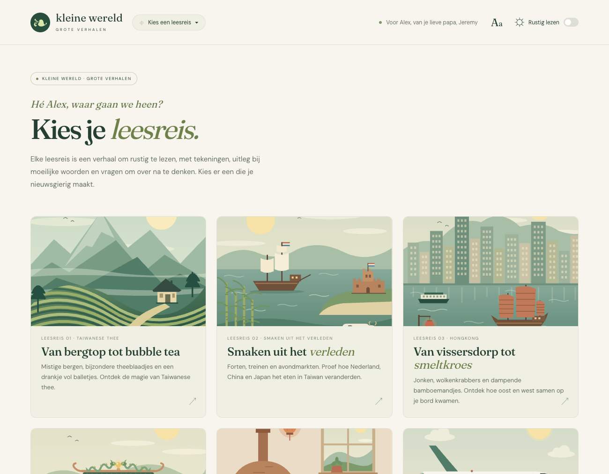
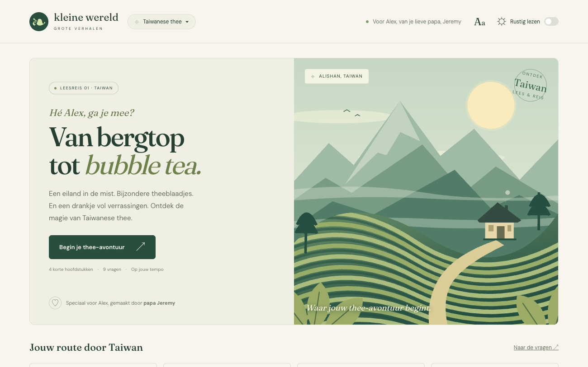

# alex-leesreizen

Calm, illustrated Dutch reading journeys (*leesreizen*) for practising reading comprehension (*begrijpend lezen*). It's a small, personal web app I made for my son Alex, so every journey is written for him and the copy speaks to him directly.



## What it does

Each journey takes one Dutch text of 3–5 paragraphs and turns it into a short trip:

- **Illustrated chapters**, one per paragraph, each with its own flat SVG drawing. Each journey opens with a gently animated scene.
- **Word help:** harder words are highlighted, and tapping one shows a child-friendly explanation.
- **Seven multiple-choice questions**, each with an explanation of the right answer and a score at the end.
- **Two open questions** answered in your own words, then compared with an example answer. They aren't graded automatically, so you can talk them over together.
- **A personal closing message** and the option to start the journey again.

There's no timer, no streaks and no pressure. Any chapter or question can be opened at any time.



### Journeys so far

| # | Title | Topic |
|---|---|---|
| 01 | Van bergtop tot bubble tea | Taiwanese tea, from mountain oolong to bubble tea |
| 02 | Smaken uit het verleden | How colonial history shaped Taiwanese food |
| 03 | Van vissersdorp tot smeltkroes | How Hong Kong grew, and east meets west in its food |
| 04 | Kleurrijke tempels | The gods and goddesses of Taiwan's temples |
| 05 | Bizarre pizza's | The strangest pizza flavours of Asia |
| 06 | Vliegen in de toekomst | Flying the Airbus A350 to Hong Kong |
| 07 | Achter de schermen | How alex-reads.ink works, from the name to the server |
| 08 | De stad zonder regels | Kowloon Walled City, and the cyberpunk stories that kept it alive |
| 09 | De stad zonder regels (opus5.5-xhigh) | The same Kowloon Walled City text, generated by another model for comparison |

### Comfortable reading

- **Rustig lezen** (quiet mode) hides the illustrations, stops the animations and gives the text more room.
- A button to enlarge the text.
- Full keyboard support, visible focus, layouts down to 360px wide, and respect for `prefers-reduced-motion`.

## Running it

You need Node.js 18 or newer. There's nothing to install:

```sh
npm start
```

Then open <http://localhost:3000>. The server only listens on your own computer (`127.0.0.1`). Set `PORT` to use a different port. `npm run serve` starts it in the background instead.

Publishing to <https://alex-reads.ink> is described in [docs/railway.md](docs/railway.md). Answers still stay in the browser.

Open the app through the server, not as a file, because it fetches each journey's text.

## Privacy

There are no accounts, no analytics and no backend. Answers and settings are saved only in the browser's `localStorage`. Only the fonts load from Google Fonts, and without internet the page falls back to local fonts.

## How it's built

Plain HTML, CSS and browser JavaScript modules: no framework, no build step, no dependencies. [GSAP](https://gsap.com) drives the hero animations and is vendored in `vendor/`.

```
index.html, app.js, styles.css   page shell, views and router, styles
store.js                         saved answers and settings (localStorage)
motion.js                        shared animation runtime
server.mjs                       small local static server
journeys/index.js                list of journeys, in display order
journeys/<slug>/
  text.md                        the Dutch text: a title and paragraphs
  journey.js                     chapters, glossary, questions, all copy
  art.js                         SVG illustrations
  motion.js                      the hero animation
scripts/                         checks and screenshot tools
```

### Checks

```sh
npm run check            # validates every journey's data and the storage migration
npm run check:browser    # end-to-end run of every journey in headless Chrome
npm run screenshot -- '#/taiwan' --text   # screenshot, plus a text tone map
```

The browser checks use the Chrome on your machine with a throwaway profile, so they never touch real saved answers.

## Made with Claude Code

The app and its journeys are written with [Claude Code](https://claude.com/claude-code). To add a journey, I supply a Dutch text (a title and 3–5 paragraphs) and two open questions, and run the `/new-journey` skill (`.claude/skills/new-journey/SKILL.md`). Claude writes the rest: the chapters, glossary, multiple-choice questions and explanations, example answers, illustrations and animation. It then registers the journey and checks it in a browser.

`AGENTS.md` holds the project conventions that Claude follows: Dutch for everything Alex sees, English for code and docs, a warm tone, and never reordering the questions of a published journey because saved answers depend on their order.

The texts themselves come from me. The quiz answers are checked by a human, because the automated checks can't tell whether an answer is factually right.

## Licence

[MIT](LICENSE). GSAP in `vendor/` is distributed under its own [licence](https://gsap.com/standard-license).
